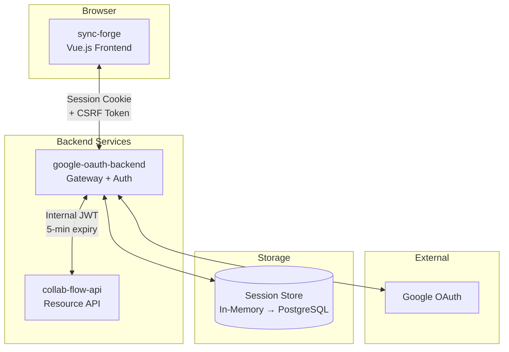
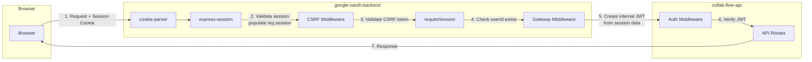
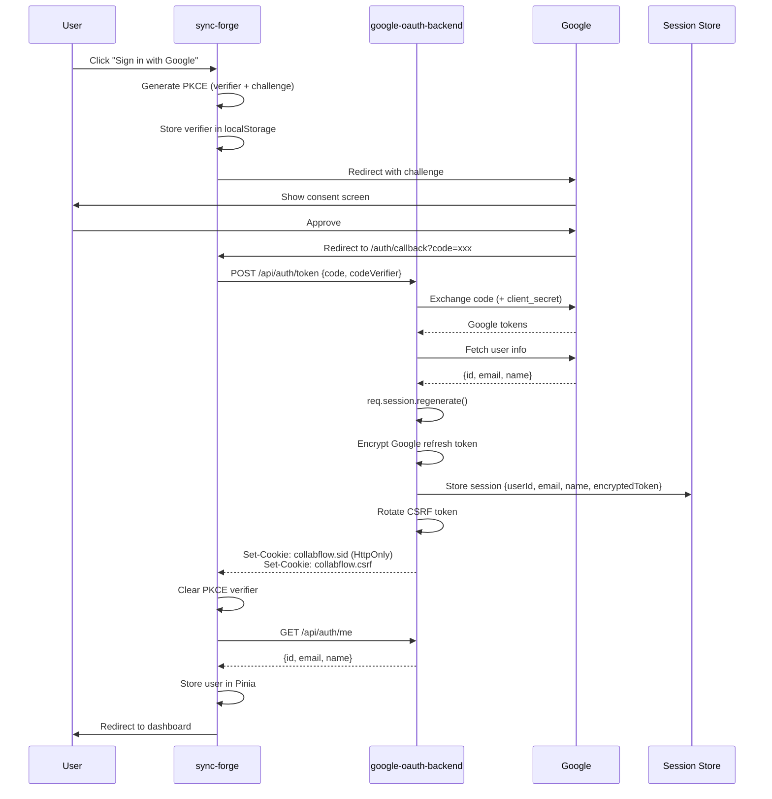
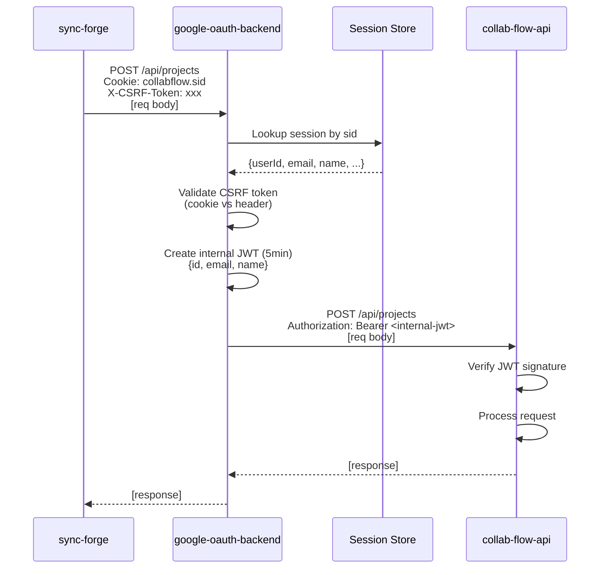
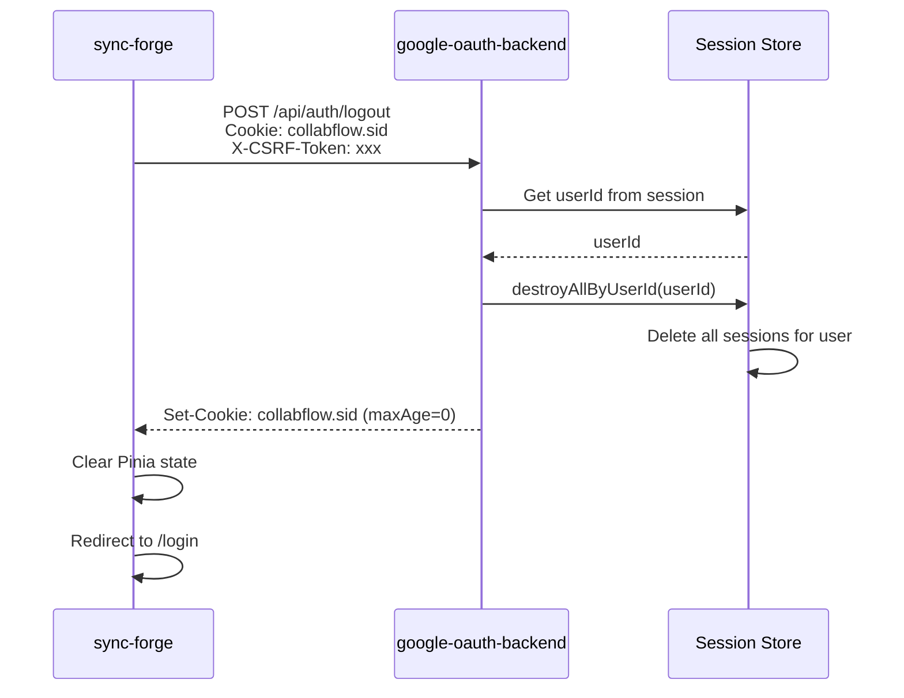
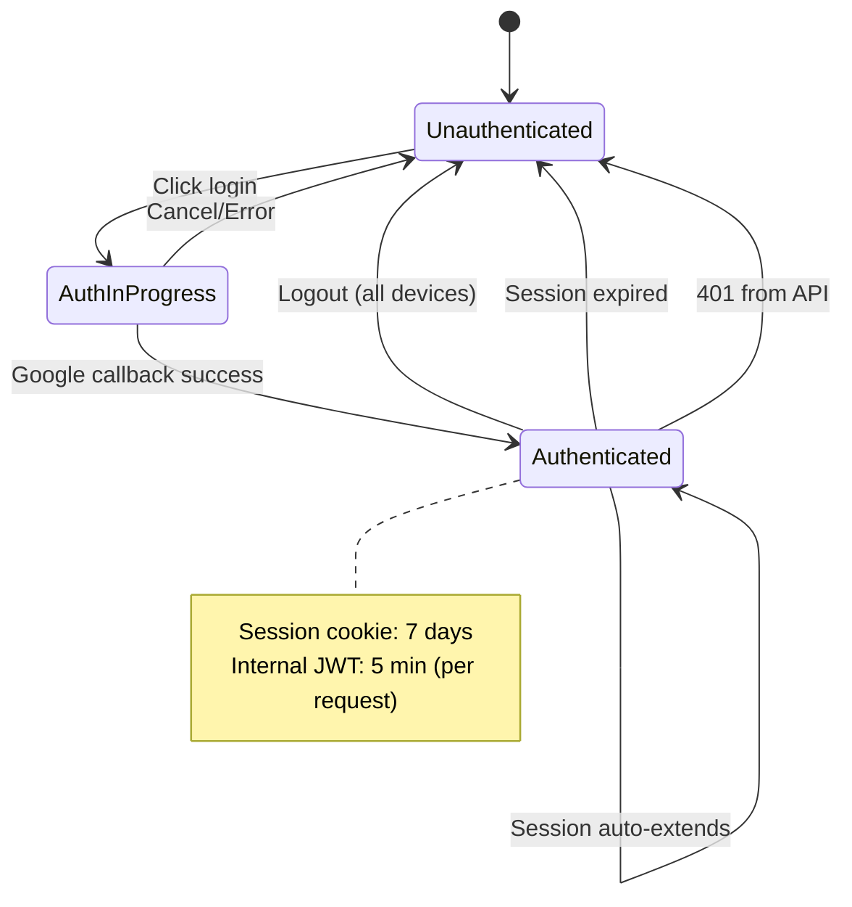

# Session-Based Authentication - Architecture Diagrams

---

## 1. High-Level Component Architecture

---

## 2. Request Flow Architecture

---

## 3. Login Flow

---

## 4. API Request Flow (State-Changing)

> **Note:** CSRF validation only occurs for state-changing methods (POST, PUT, PATCH, DELETE).
> GET, HEAD, and OPTIONS requests skip CSRF validation.

---

## 5. Logout Flow (All Devices)

---

## 6. Session Lifecycle State Diagram

